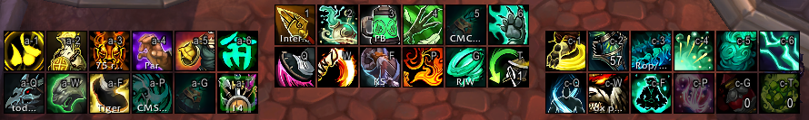

# HideActionBarBorders

A very small and efficient addon to hide the borders of the default action bars in World of Warcraft: Dragonflight.

This will likely interact badly with other action bar addons (including ElvUI) and should only be used with default action bars.

## Getting Square Icons

To get clean, square icons as shown in the screenshot above, download and install [Clean Icons - Mechagnome Edition](https://www.wowinterface.com/downloads/info25064-CleanIcons-MechagnomeEdition.html). This is a no-code icon pack that will not impact your game's performance.

## Highlight Changes

This includes an updated highlight texture courtesy of `@Fatpala` that makes the mouseover, keypress, and item highlights line up with square icons. I do not currently have a way of *detecting* whether you're using square icons, so this is on by default.

# License

Copyright 2022 emallson.

Published under the BSD 3-clause license. See [LICENSE](./LICENSE) for details.